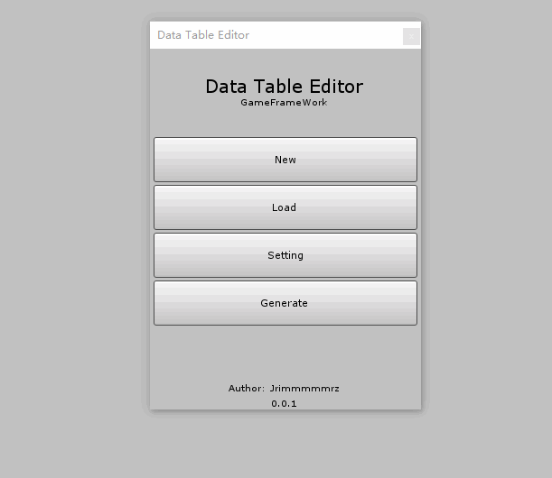
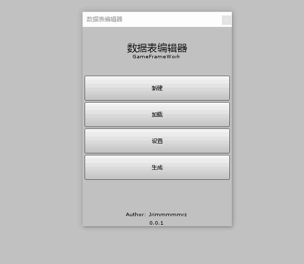

# Data Table Editor 数据表编辑器 
 
  
 
 Datatable Editor For GameFrameWork 
  
 一个[GameFrameWork](https://gameframework.cn/)框架的数据表快速编辑器 
 
 
# Feature 特性 
 
 New 新建数据表 
  
 
 
 Load 加载数据表 
  
 
 
 Setting 配置数据表 
  
 
 
 Generate 生成数据 
  
 
 
# How To Use 使用 
 1.Download [GameFrameWork](https://gameframework.cn/) and import 
 下载框架导入 
  
 2.Download [DataTableEditor](https://github.com/qtghost/DataTableEditor/releases/latest) and import
 下载该编辑器并导入（注意，该操作会进行对DataTableProcessor进行覆盖） 
 
 3.Change your Setting 
 更改你的设置，比如空间命名 
  
 4.New or Load a file(txt export from excel) 
 新建或加载一个表格 
  
 5.Generate 
 记得改完表格进行生成。会自动生成需要的文件，如果有问题请直接提[issue](https://github.com/qtghost/DataTableEditor/issues/new) 
 
# TO DO
  
 ***~~1.自动扫描~~** 
  
 ***~~2.移动数据位置~~** 
  
 3.使该工具脱离框架一样可以使用 
 
